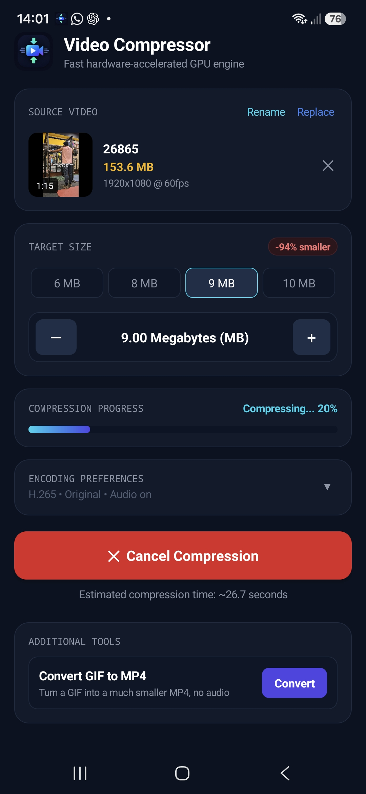
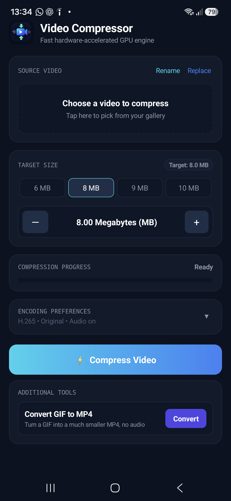
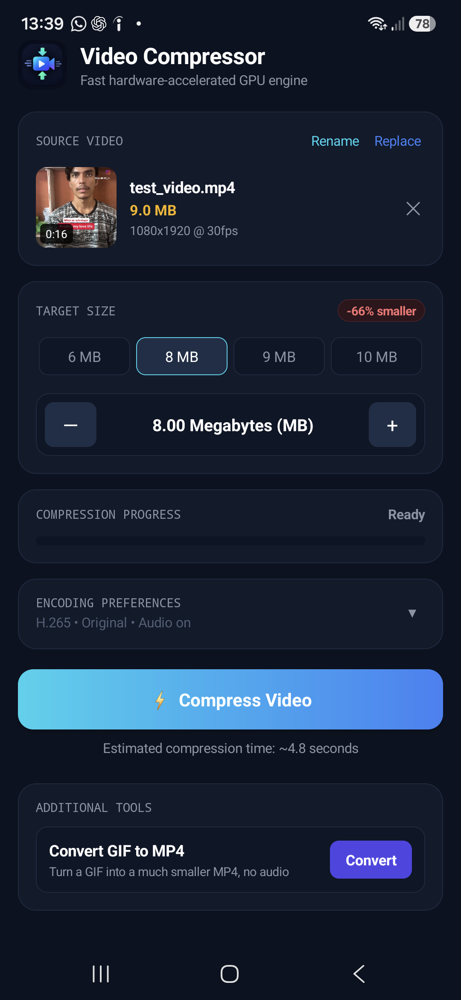
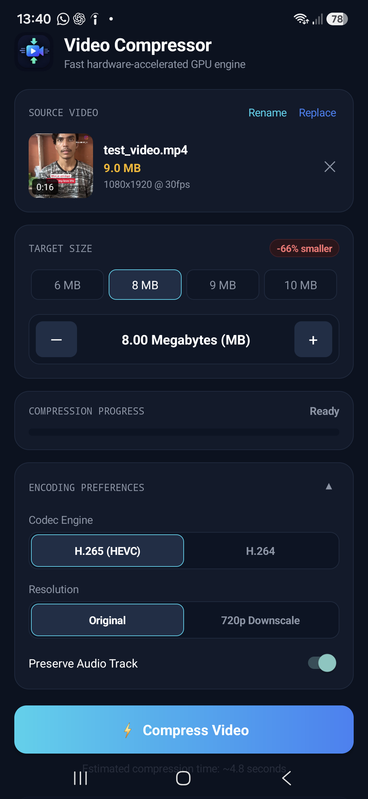
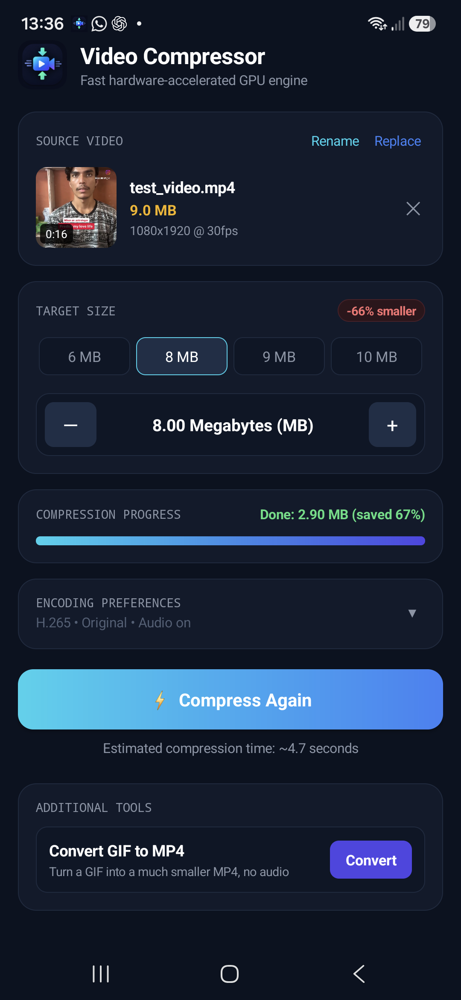

# Video Compressor

A fast, lightweight Android app that compresses videos to a target file size using your phone's hardware encoder, and converts GIFs to MP4. Compression keeps running in the background while you use other apps.

I built this for myself because online compressors like Compress2go sometimes have slow download speeds. The code is AI-generated and personalized for my own use, and I'm sharing it in case it helps someone else.



## Download

Get the latest APK from the **[Releases page](https://github.com/Akki-Maharaj/Video-compressor/releases/latest)**.

### Install

1. Download `VideoCompressor.apk` on your phone.
2. Open the file. If Android asks, allow **Install unknown apps** for your browser or file manager.
3. Tap **Install**. If Play Protect shows a warning, that's normal for apps installed outside the Play Store.
4. Recommended on Samsung: go to **Settings > Apps > Video Compressor > Battery > Unrestricted**, so One UI doesn't stop background compression.

### Requirements

- Android 8.0 (API 26) or newer
- Built and tested on a Samsung phone running Android 16 (One UI)

## Features

- **Target size compression:** choose 6, 8, 9, or 10 MB, or type a custom size. The app calculates the bitrate to aim for it.
- **Hardware accelerated:** uses the device's hardware video encoder through Jetpack Media3 Transformer instead of slow software encoding.
- **Background processing:** runs as a foreground service with a progress notification, so you can switch to other apps.
- **Live progress bar:** shows how far the compression has got.
- **Encoding preferences:** an expandable panel to pick H.265 (HEVC) or H.264, keep the original resolution or downscale to 720p, and keep or remove the audio track.
- **Rename output:** set the file name of the compressed video.
- **GIF to MP4:** turn a GIF into a much smaller MP4 with no audio.
- **Fast startup:** native Kotlin with plain Android views and no heavy libraries.

Compressed files are saved to `Movies/Compressed` on your device. Your original video is never modified.

## Screenshots

| Empty | Video selected | Preferences expanded | Compressing |
|:---:|:---:|:---:|:---:|
|  |  |  |  |

## How to use

1. Tap **Choose a video** and pick a file.
2. Select a target size.
3. Optional: expand **Encoding Preferences** to change the codec, resolution, or audio.
4. Tap **Compress Video**. Watch the progress bar, or leave the app and follow the notification.
5. Find the result in your gallery under `Movies/Compressed`.

For GIFs, tap **Convert** in the Additional Tools card and pick a GIF.

## Build from source

You need JDK 17 or newer (tested with JDK 25) and the Android SDK with platform 36 and build-tools 36.0.0.

```
git clone https://github.com/Akki-Maharaj/Video-compressor.git
cd Video-compressor
gradlew assembleDebug
```

The debug APK is created at `app/build/outputs/apk/debug/app-debug.apk`. Install it on a connected phone with:

```
adb install -r app/build/outputs/apk/debug/app-debug.apk
```

To build a signed release APK, create your own keystore and a `keystore.properties` file, then run `gradlew assembleRelease`. Never commit your keystore or its passwords.

## Tech stack

- Kotlin
- Android Gradle Plugin 9 with built-in Kotlin
- Jetpack Media3 Transformer (hardware H.265 and H.264 encoding)
- Foreground service (`mediaProcessing`)
- Android Photo Picker and MediaStore

## Known limitations

- Hardware encoders are single-pass, so the final size can land roughly 5 to 10 percent above or below the target. Set the target a little lower if you have a hard size limit.
- Very aggressive targets (for example 100 MB down to 2 MB) will look blocky. Choosing 720p helps.
- H.265 files may not play in some older apps or websites. Choose H.264 for maximum compatibility.
- Support for formats like AVI depends on the decoders available on your phone.
- Compression speed depends on your phone's chip.

## Contributing

Issues and pull requests are welcome. This is a personal project, so responses may be slow.
